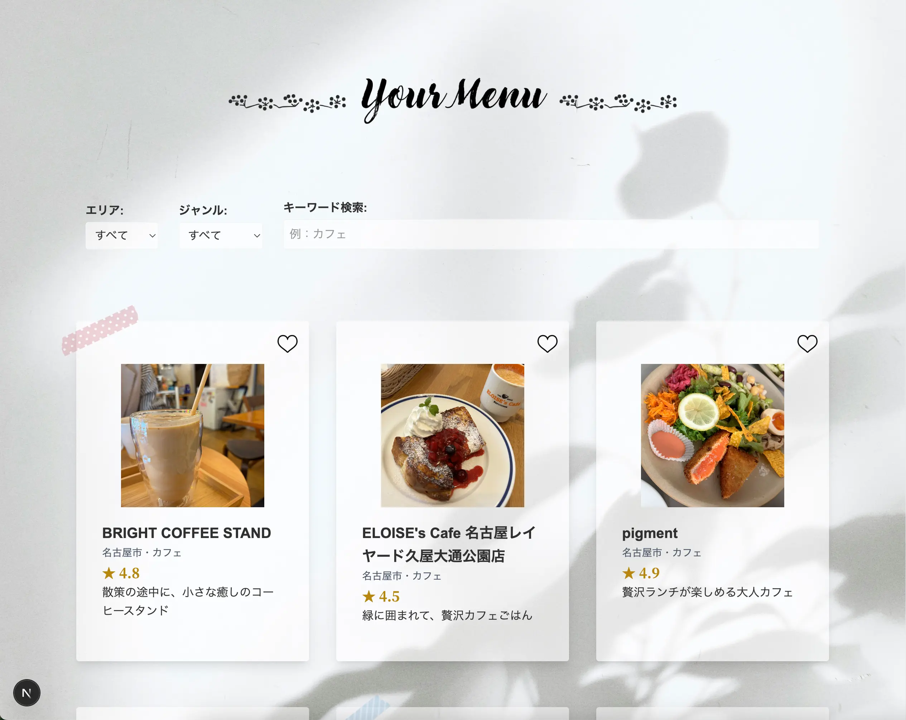

# gourmet-app

Next.js と Rails API で構築した、シンプルなグルメ情報共有アプリ「Your Menu」
React と TypeScript を活用しながら、フルスタック開発およびフロントエンドとバックエンドの連携を学習中です。

## リポジトリ構成について

本プロジェクトのフロントエンドは、別リポジトリで管理されているバックエンドAPIサーバーと連携しています。  
バックエンドのリポジトリはこちらです → https://github.com/brown-96253/rails-backend-app

## スクリーンショット



## 主な機能

- 飲食店一覧の表示（Rails API から動的に取得）
- エリア・ジャンル・店舗名による検索・フィルター機能
- Tailwind CSSによるレスポンシブデザイン調整
- お気に入り登録ボタン（localStorage に保存）
- レビュー投稿フォーム
- テストコード

## 使用技術

### フロントエンド
- Next.js（App Router）
- React
- TypeScript
- Tailwind CSS

## 今後の予定
- テストコードの改善
- お気に入り機能のブラッシュアップ（localStorageの活用）
- アクセシビリティの改善

## 起動方法（ローカル環境）

### 1. このリポジトリをダウンロードまたはクローンしてください
```bash
git clone https://github.com/brown-96253/gourmet-app-rails-test.git
cd gourmet-app-rails-test
```

### 2. 依存パッケージをインストール
```bash
npm install
```

### 3. 開発サーバーを起動
```bash
npm run dev
```

### 4. APIの接続先を設定（`.env` ファイルを作成）

ルートディレクトリに `.env` ファイルを作成し、以下を記入してください：
```env
NEXT_PUBLIC_API_URL=http://localhost:3001
```
ポート番号はバックエンドの起動時のポートに合わせて変更してください。
